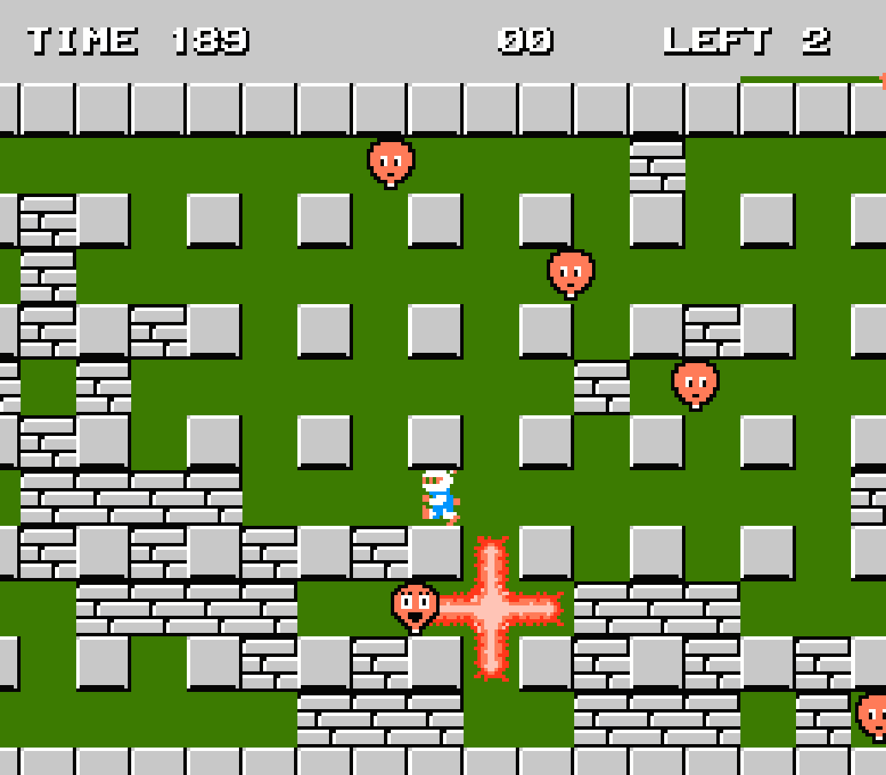

# Bomberman NES en JavaScript

Este es un proyecto que recrea el clásico juego Bomberman lanzado originalmente para la consola NES (Nintendo Entertainment System), implementado completamente en JavaScript utilizando la tecnología Canvas para la representación gráfica.

## Características Principales

- **Jugabilidad Clásica**: El juego conserva la esencia y mecánicas del Bomberman original de NES.
- **Múltiples Niveles**: Cuenta con varios niveles de dificultad creciente, cada uno con su propio diseño de laberinto y desafíos.
- **Enemigos y Power-Ups**: Los enemigos rondan los laberintos, y al derrotarlos, el jugador puede obtener power-ups que mejoran las capacidades de Bomberman.
- **Modo Multijugador**: Posibilidad de jugar en modo multijugador local, permitiendo a dos jugadores competir entre sí o cooperar para superar los niveles.

## Tecnologías Utilizadas

- **JavaScript**: El juego está completamente implementado en JavaScript, aprovechando las características modernas del lenguaje.
- **HTML5 Canvas**: Se utiliza Canvas para la representación gráfica del juego, permitiendo una experiencia visual similar a la del juego original de NES.
- **CSS**: Estilos CSS para la maquetación y presentación básica del juego en la página web.

## Instrucciones de Uso

1. Clona el repositorio en tu máquina local.
2. Abre el archivo `index.html` en tu navegador web.
3. Utiliza las teclas direccionales para mover a Bomberman por el laberinto y la barra espaciadora para colocar bombas.
4. ¡Supera los desafíos de cada nivel, derrota a los enemigos y llega a la salida!

## Contribuciones

¡Las contribuciones son bienvenidas! Si tienes sugerencias de mejoras, nuevas características o correcciones de errores, no dudes en enviar un pull request.
